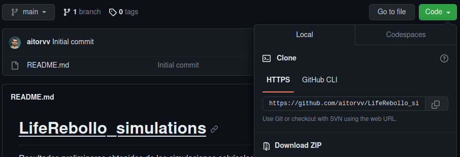

# Elaboración de modelo de gestión adaptativa de rebollares

---

Este trabajo se enfoca en explorar las estrategias selvícolas más adecuadas para la transformación de rebollares con estructuras regulares a estructuras irregulares y para la gestión de las masas irregulares. Además, entre los objetivos perseguidos encontramos la adaptación de la gestión conforme a la evolución del clima, maximizando la fijación de carbono y la obtención de madera de calidad.

---

### Cómo Utilizar este Repositorio

Puedes consultar el contenido de este repositorio de manera online o bien descargarlo pinchando en el botón superior verde **Código** y a continuación seleccionando la opción **Descargar ZIP**, tal y como se muestra a continuación:

---

### Contenido del Repositorio

:books: **bibliografía**: contiene un archivo *.bib* con la bibliografía consultada para la elaboración del documento

:computer: **codigo**: scripts de R utilizados para la elaboración de gráficos

:floppy_disk: **datos**: 

- *input*: inventarios iniciales SG02 y SO02
- *output*: resultados de las simulaciones

    - irregular: resultados de la gestión de masas irregulares
    - SG: resultados de la transformación de la parcela SG02 de masa regular a irregular
    - SO: resultados de la transformación de la parcela SO02 de masa regular a irregular

:bar_chart: **graficos**: gráficos realizados a partir de los resultados de las simulaciones

- *dbh*: gráficos de distribución de las clases diamétricas para cada caso de estudio
- *figuras*: figuras utilizadas en el documento
- *selvicultura*: gráficos para variables selvícolas de interés

    - irregular: resultados de la gestión de masas irregulares para las parcelas SG02 y SO02 tras haber realizado la conversión a masas irregulares
    - SG: resultados de la transformación de la parcela SG02 de masa regular a irregular
    - SO: resultados de la transformación de la parcela SO02 de masa regular a irregular

---

### Acerca del proyecto 

Los bosques de rebollo (Quercus pyrenaica) de Castilla y León (reconocidos como Hábitat de Interés Comunitario 9230), serán objeto de estudio y campo de experimentación de un nuevo proyecto europeo, el LIFE +REB, y en el que hasta 2025 colaborarán nueve entidades, con el propósito de trabajar en el marco de una “silvicultura climáticamente inteligente” (conocida en el ámbito investigador como Climate-Smart Forestry, CSF), aplicada a las masas de rebollo de Castilla y León.

Además de los aspectos medioambientales (mitigación del cambio climático, mejora de la resiliencia de las masas forestales, conservación y mejora de la biodiversidad y sustitución de materiales fósiles), el proyecto también persigue convertirse en un marco generalizado de gestión forestal y contribuir a la dinamización de las economías rurales con productos de almacenamiento de carbono a largo plazo.

LIFE +REB se propone también contribuir a la consecución de las estrategias iniciativas europeas (Pacto Verde, Estrategia Europea de biodiversidad, Estrategia Europea de bioeconomía, Plan de Acción de la Economía Circular o Estrategia de adaptación al cambio climático de la UE), otras de carácter nacional como el Plan Nacional de Energía y Clima, Plan Nacional de Adaptación, la Estrategia de descarbonización a largo plazo o la Lucha contra la despoblación).

[Web oficial del proyecto](https://liferebollo.es/)

---

